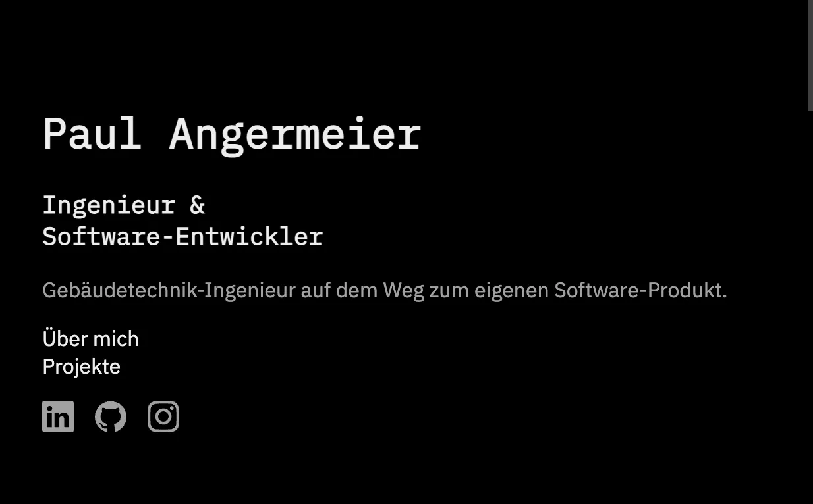
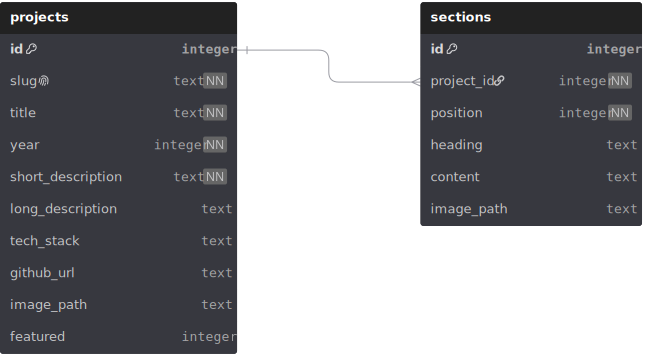

# Portfolio Website

A database-driven portfolio platform built with Flask, designed to present my software projects and to grow with each new one. Created as my final project for Harvards CS50x.



## About

This site marks the starting point of my transition into software development. I work as a building systems engineer and the wish to move into software has been with me since my university days - CS50 was the first and decisive step.

Rather than building a static page, I built a small content platform. Every Project shown on the site lives in a database, and detail pages are assembled from flexible content sections. New projects and new content are added purely through data, no changes to templates or structure required. The long-term goal behind all of this is a bootstrapped software product of my own. This site documents the road there.

## Tech Stack

- Python/ Flask - deliberately a micro-framework instead of a full-stack framework. I wanted to build and understand every layer myself: routing, database access, templating. Also Flask was tought during CS50, so it felt natural to build the application with it. 
- SQLite (via Pythons native `sqlite3` module, not the CS50 library) - a file-based database is the right fit for a portfolio site with read-only traffic: no server, no configuration, no dependencies.
- Jinja2 - server side rendering: no frontend framework, no JavaScript overhead for a content-driven site.
- Vanilla CSS - a custom design system built on CSS custom properties

## Architecture & Data Model

The data model consists of two tables joined by a one-to-many relationship:




- `projects` holds the uniform metadata of every project (title, slug, year, descriptions, tech stack, links, image)
- `sections` holds the freely structured content of the detail pages. Each section belongs to one project (`project_id` enforced as a foreign key) and carries a `position` column that defines its order on the page.

A project can have any number of sections or none. This is what lets the site grow without structural changes: adding a project is an `INSERT` not a redesign.

Implementation details worth noting:
- Foreign key enforcement is explicitly enabled per connection via `PRAGMA foreign_keys = ON` (SQLite has it off by default).
- All queries are parameterized, ruling out SQL Injection structurally.
- Conten fields that contain intentional HTML (such as `long_description` and section `content`) are rendered with Jinja's `| safe` filter, applied only to these trusted, self-authored fields. 
- External links use `rel=noopener` together with `target=_blank` to prevent tabnabbing. 

## Design

The design follows a simple principle: content first, everything else steps back. A monochromatic palette on a dark background, generous whitespace and a clear visual hierarchy replace decorative elements. The look is inspired by [Brittany Chiang's portfolio](https://brittanychiang.com), implemented independently from scratch.

- **Design tokens:** colors, fonts and spacing are defined centrally as CSS custom properties — one change propagates consistently across the site.

- **Typography:** IBM Plex Sans for body text, IBM Plex Mono for headings and technical elements. Both are self-hosted as WOFF2 (`@font-face` with `font-display: swap`) — for privacy reasons (no Google Fonts CDN) and full control over loading behavior.

- **Interaction:** subtle hover effects — an animated underline sweep built with `transform: scaleX()` for GPU-friendly rendering — provide feedback without distraction.

- **Responsive:** mobile-first, tested across common viewport sizes.

## Project Structure

```
portfolio/
├── app.py # Flask app: routes, database access, teardown
├── portfolio.db # Database generated by seed.py
├── schema.sql # Database schema (projects, sections)
├── seed.py # Seeds the database with real project content
├── requirements.txt
├── templates/
│ ├── base.html # Layout: header, navigation, footer
│ ├── index.html # Landing page: hero, about, featured projects
│ ├── projects.html # Project overview
│ ├── project_detail.html # Project detail page (sections)
│ └── 404.html # Error page
└── static/
  ├── style.css # Design system & styles 
  ├── fonts/ # Self-hosted IBM Plex (WOFF2)
  └── images/ # Project screenshots (WebP), ER diagram (SVG)
```

## Setup & Run

```bash
# Clone and enter
git clone git@github.com:paulangermeier/portfolio.git
cd portfolio

# Create and activate a virtual environment
python3 -m venv venv
source venv/bin/activate

# Install dependencies
pip install -r requirements.txt

# Create and seed the database
python seed.py

# Run
flask run
```

The site is then available at `http://127.0.0.1:5000`.
## Known Limitations & Roadmap

Some decisions were deliberately scoped out of the MVP:
- **Content management:** content is currently maintained via `seed.py`. A login-protected admin area for editing content directly is planned.
- **Image alt texts:** section images currently use empty `alt` attributes; a dedicated `alt_text` column is planned.
- **Cascade behavior:** deleting a project does not yet cascade to its sections (`ON DELETE CASCADE` planned).

Larger ideas remain deliberately open until they serve a real purpose.

## Acknowledgments

Built as final project for [CS50x](https://cs50.harvard.edu/x/), Harvard University's Introduction to Computer Science. Design inspired by [Brittany Chiang](https://brittanychiang.com).